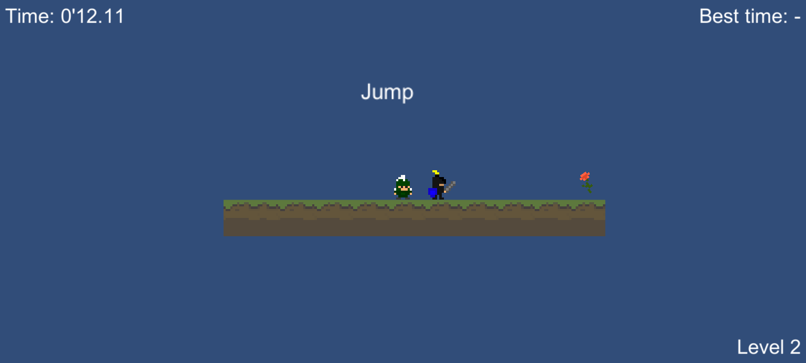

## Spartry'n'die ##

Spartry'n'die is a 2D platform game build in Unity.  
It is a Die'n'Retry where you have to finish each level the fastest you can.  
There are some bonus levels which ask skills or reflexion.  
Some ennemies are going to your last position on the ground.

You can pause/unpause the game with 'P' key or 'Start' button.  
You can exit the game at any time with 'Escape' key or 'B' button (on controller).  
The other inputs are inside the About menu.

---

Download links :

[WebGL](https://minhaskamal.github.io/DownGit/#/home?url=https://github.com/nicolasventer/Game_design_course/tree/master/Course%204/Spartry'n'die/WebGL)

[Windows](https://github.com/nicolasventer/Game_design_course/raw/master/Course%204/Spartry'n'die/Spartry'n'dieWindows.zip)

[Mac](https://github.com/nicolasventer/Game_design_course/raw/master/Course%204/Spartry'n'die/Spartry'n'dieMac.zip)
